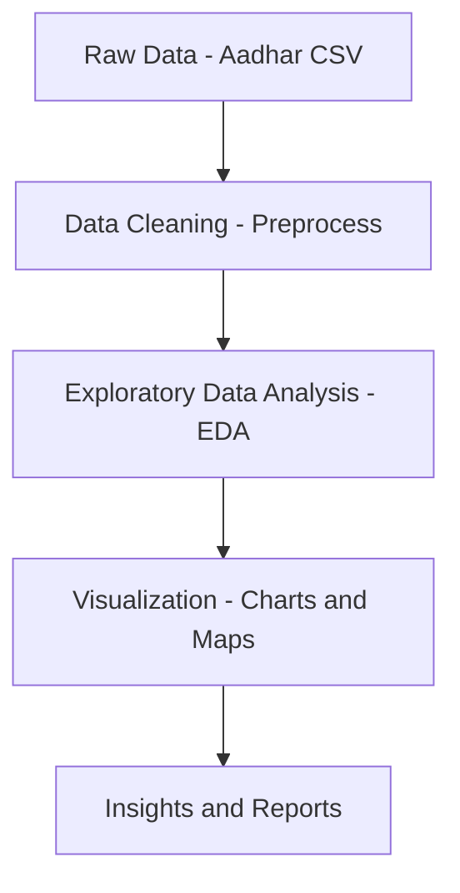

# Aadhar_Analysis


## Introduction

Aadhar_Analysis is a data analysis and visualization project designed to explore and extract insights from the Aadhar dataset. The repository provides tools and scripts for cleaning, processing, analyzing, and visualizing Aadhar-related data. It is built with a focus on reproducibility, scalability, and ease of use for data science and analytics tasks.

---

## Features

- Data cleaning and preprocessing of large Aadhar datasets
- Exploratory Data Analysis (EDA) with descriptive statistics
- Interactive and static visualizations (bar charts, pie charts, maps)
- Gender, state, and demographic breakdowns of Aadhar registrations
- Time-series analysis and trend identification
- Modular Python scripts for custom analyses
- Jupyter Notebook support for step-by-step exploration

---

## Usage

To use the Aadhar_Analysis project:

- Clone or download the repository to your local machine.
- Prepare your dataset in the expected format.
- Run the appropriate scripts or open the Jupyter notebooks to perform analysis and generate visualizations.
- Explore output plots and results.

Typical analysis workflow:

1. Data preprocessing: Clean and prepare the raw data.
2. EDA: Run notebooks or scripts for exploratory analysis.
3. Visualization: Generate graphs, charts, and maps.
4. Interpretation: Review findings and insights.

---

## Requirements

To run the Aadhar_Analysis project, ensure you have the following:

- Python 3.7 or above
- Jupyter Notebook (for interactive exploration)
- Required Python libraries:
  - pandas
  - numpy
  - matplotlib
  - seaborn
  - plotly

---

## Installation

Follow these steps to set up the project on your machine:

1. Clone the repository:
    ```bash
    git clone https://github.com/khushi-infinity/Aadhar_Analysis.git
    cd Aadhar_Analysis
    ```

2. (Optional but recommended) Create and activate a virtual environment:
    ```bash
    python -m venv venv
    source venv/bin/activate  # On Windows: venv\Scripts\activate
    ```


3. (Optional) Install Jupyter Notebook interface:
    ```bash
    pip install notebook
    ```

---


## Contributing

Contributions are welcome! To contribute:

- Fork the repository and create your feature branch.
- Make your changes with clear commit messages.
- Ensure all scripts and notebooks are well-documented.
- Test your changes with provided sample data.
- Submit a pull request with a detailed description of your modifications.

For major changes, please open an issue first to discuss what you would like to change or add.

---

## Project Structure

```
Aadhar_Analysis/
├── datasets/         # Raw and processed datasets
├── Aadhar_Analysis/  # Google collab notebook for analysis
├── UIDAI_2536/       # Detailed Project Report
├── LICENSE           # License file (MIT)
├── README.md         # Project documentation
```

---

## Example Data Flow

The following diagram summarizes the typical data flow in this project:



---

## Contact

For questions, suggestions, or feedback, please open an issue or contact the repository maintainer via GitHub.

---

Thank you for using and contributing to **Aadhar_Analysis**!


## License

This project is licensed under the MIT License. You are free to use, modify, and distribute the code with proper attribution. See the `LICENSE` file for more details.

---
